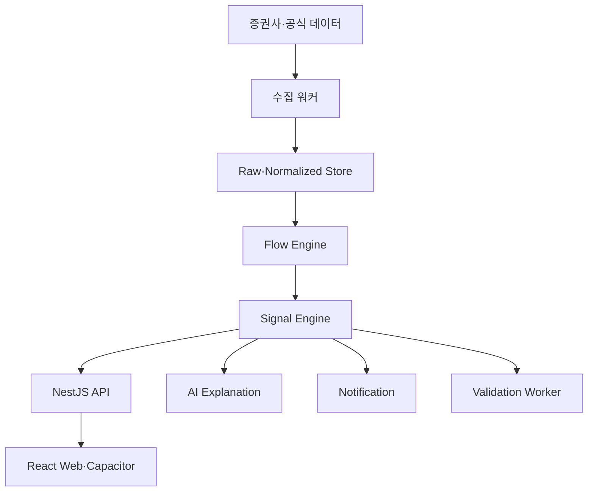
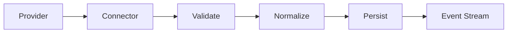
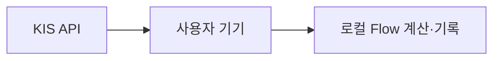
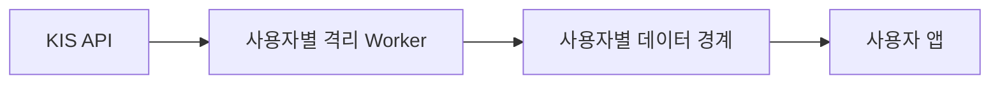

# FlowPulse AI 기술아키텍처

- 문서명: `11_기술아키텍처.md`
- 버전: v1.0
- 작성일: 2026-08-10
- 상태: MVP 기술 기준안
- 선행 문서: `04_MVP_SCOPE.md`, `05_독자수급지표.md`, `06_데이터소스_계약.md`, `06_01_개인_BYOK_모드.md`, `09_AI해설정책.md`, `10_UX_설계.md`

---

## 1. 문서 목적

이 문서는 FlowPulse MVP의 프런트엔드, 모바일 앱, API 서버, 실시간 데이터 수집, Flow 지표 계산, Playbook 상태, AI 해설, 알림, 사후검증, 저장소, BYOK 격리, 보안과 운영 구조를 정의한다.

기술아키텍처는 다음 제품 요구를 지원해야 한다.

- 장중 데이터 상시 수집
- 5분·15분·30분 수급 계산
- Flow Shift·Sync·Confidence 실시간 갱신
- Program Dip Reversal·Rally Exit 상태 전이
- 모바일·PC 동일 핵심 경험
- 사용자 직접 판단과 기록
- 데이터 지연·누락·정정 처리
- 신호 발생 당시 상태 보존
- 10분·30분·종가·1일·5일 사후검증
- 개인 BYOK 데이터 격리

---

## 2. 아키텍처 원칙

1. MVP는 모듈형 모놀리스로 시작한다.
2. 데이터 수집 워커는 사용자 API 서버와 분리한다.
3. 원본·정규화·파생·스냅샷 데이터를 구분한다.
4. REST 초기 스냅샷과 WebSocket 변경분을 조합한다.
5. AI 장애가 데이터·지표·기록 기능을 가리지 않게 한다.
6. 모든 계산과 해설은 버전을 가진다.
7. 동일 이벤트를 여러 번 받아도 결과가 중복되지 않게 한다.
8. 공급사 시각과 서버 수신 시각을 모두 보존한다.
9. BYOK Secret과 사용자 데이터는 테넌트별로 격리한다.
10. 정식 권한이 확인되지 않은 데이터는 공개 경로로 전달하지 않는다.

---

## 3. 전체 구조



### 기본 구성

| 영역 | 구성 |
|---|---|
| 사용자 웹 | React + TypeScript 반응형 SPA/PWA |
| 모바일 | Capacitor iOS·Android |
| 관리자 | Next.js 관리자 웹 |
| API | NestJS 모듈형 모놀리스 |
| 수집 | 별도 Node.js/NestJS Worker |
| 시계열 DB | PostgreSQL + TimescaleDB |
| 캐시·스트림 | Redis |
| 실시간 | WebSocket |
| 작업 큐 | Redis 기반 Queue |
| AI | 구조화 입력·출력 AI 서비스 |
| 초기 인프라 | Oracle Cloud ARM Ubuntu 우선 |

---

## 4. 배포 단위

MVP 초기 배포 단위는 다음과 같다.

```text
web-app
admin-web
api-server
market-ingestion-worker
flow-signal-worker
validation-worker
notification-worker
postgres-timescale
redis
reverse-proxy
```

코드 저장소는 하나로 유지할 수 있지만 프로세스와 장애 경계는 분리한다.

### 분리 이유

- API 트래픽 급증이 데이터 수집을 중단시키지 않음
- AI 지연이 Flow 계산에 영향을 주지 않음
- 사후검증 배치가 장중 수집을 방해하지 않음
- 워커별 재시작과 확장 가능

---

## 5. 모듈형 모놀리스 구조

API 서버 내부 모듈:

```text
AuthModule
UserModule
MarketModule
StockModule
WatchlistModule
FlowMetricModule
SignalModule
PlaybookModule
TradingRecordModule
ValidationModule
AiExplanationModule
NotificationModule
FeedModule
DataConnectionModule
AdminModule
AuditModule
```

모듈 간에는 공개 서비스 인터페이스만 사용한다. 다른 모듈의 테이블을 직접 수정하지 않는다.

초기에는 하나의 NestJS 애플리케이션으로 배포하되 부하·보안·팀 규모가 커질 때 독립 서비스로 분리할 수 있게 경계를 유지한다.

---

## 6. 프런트엔드 구조

### 사용자 앱

- React
- TypeScript strict mode
- 모바일 우선 반응형
- PWA
- Capacitor 패키징
- REST 초기 조회
- WebSocket 변경분 구독
- 로컬 캐시

### 권장 폴더 경계

```text
apps/user-app/src/
├─ app/
├─ routes/
├─ features/
│  ├─ flow-home/
│  ├─ stock-detail/
│  ├─ signals/
│  ├─ playbook-records/
│  ├─ validations/
│  ├─ ai-explanation/
│  ├─ feed/
│  └─ byok/
├─ entities/
├─ shared/
│  ├─ api/
│  ├─ websocket/
│  ├─ ui/
│  ├─ charts/
│  └─ security/
└─ capacitor/
```

### 상태 구분

- 서버 상태: Query Cache
- 실시간 상태: WebSocket Event Store
- 화면 상태: Feature Store
- 민감정보: OS Secure Storage 또는 허용된 격리 저장소

하나의 전역 상태 객체에 모든 시장 데이터를 넣지 않는다.

---

## 7. Web·Capacitor 전략

### 공통 코드

- 화면·라우팅
- Flow 카드
- 차트
- 기록
- AI 해설
- 데이터 상태

### 네이티브 어댑터

- Push Notification
- Secure Storage
- App Lifecycle
- Deep Link
- Network Status
- Haptics 선택 적용

### 정적 자산

앱 초기 화면은 가능한 한 로컬 정적 자산으로 시작한다. 핵심 데이터는 API에서 갱신한다.

### WebView 완료 조건

- 장시간 실시간 갱신
- 백그라운드 복귀
- 네트워크 단절·재연결
- 차트 제스처
- 메모리 누수
- 저사양 Android

---

## 8. 관리자 웹

Next.js 기반 관리자 화면은 사용자 앱과 분리한다.

### 기능

- 데이터 수집 상태
- 공급사 API 장애
- 종목별 최신 시각
- 신호 발생·무효 현황
- 사후검증 작업
- 지표·Playbook 버전
- AI 정책 위반
- Feed 신고
- 기능 플래그

관리자 웹에서 BYOK App Secret 원문을 조회할 수 없어야 한다.

---

## 9. 데이터 수집 파이프라인



### 단계

1. 공급사 연결
2. 인증·토큰 관리
3. 원본 수신
4. 필수 필드·시각 검증
5. 공통 스키마 정규화
6. 원본·정규화 저장
7. 내부 이벤트 발행
8. Flow 계산 트리거

### Connector 인터페이스

```text
connect()
disconnect()
refreshToken()
subscribeSymbols(symbols)
fetchSnapshot(symbol)
fetchMissingRange(symbol, from, to)
healthCheck()
```

공급사별 필드 차이는 Connector 내부에서 공통 모델로 변환한다.

---

## 10. 시장 데이터 이벤트

공통 이벤트 예시:

```json
{
  "event_id": "provider-symbol-type-timestamp-sequence",
  "provider": "KIS",
  "market": "KRX",
  "symbol": "005930",
  "event_type": "PROGRAM_TRADE",
  "source_timestamp": "2026-08-10T10:24:15+09:00",
  "received_at": "2026-08-10T10:24:15.120+09:00",
  "sequence": 123456,
  "data_status": "REALTIME",
  "payload": {}
}
```

### 필수 메타데이터

- event_id
- provider
- source_timestamp
- received_at
- data_status
- schema_version

중복 이벤트는 event_id 또는 공급사 sequence로 제거한다.

---

## 11. 시각·순서 처리

### 시각

- KST 시장 시각
- UTC 저장 또는 timezone-aware 저장
- 공급사 시각·수신 시각 분리

### 역순 이벤트

- 허용 지연창 내 버퍼링
- sequence 우선 정렬
- 오래된 이벤트는 정정 이벤트로 처리

### 누락

- sequence gap 감지
- REST로 누락 구간 요청
- 복구 전 해당 데이터 STALE 표시

### 재시작

- 마지막 처리 offset 저장
- 재시작 후 미처리 이벤트 재생
- 동일 이벤트 재처리 안전성

---

## 12. Raw·Normalized·Derived 저장

### Raw

- 계약상 허용된 원본 필드
- 공급사 응답 메타데이터
- 짧은 TTL 가능

### Normalized

- 표준 종목코드
- 표준 시간
- 가격·거래·수급 공통 모델

### Derived

- 5분·15분·30분 집계
- Flow 지표
- Signal Phase
- Playbook 판정

### Snapshot

- 신호 발생 당시 상태
- AI 입력
- 사용자 기록 연결
- 사후검증 기준

계약상 원본 보관이 제한되면 Raw TTL을 줄이고 허용된 Derived·Snapshot 범위를 별도 적용한다.

---

## 13. TimescaleDB 구조 방향

### Hypertable 후보

- price_ticks
- ohlcv_bars
- actor_flow_ticks
- actor_flow_bars
- flow_metric_points
- signal_events

### 일반 테이블

- instruments
- providers
- data_connections
- users
- watchlists
- playbooks
- metric_versions
- user_trade_records
- signal_snapshots
- validation_results
- ai_explanations
- notifications
- feed_posts
- audit_logs

정확한 컬럼과 인덱스는 `13_데이터모델.md`에서 정의한다.

---

## 14. 분봉 생성

### 기본 구간

- 1분
- 5분
- 15분
- 30분
- 일

### 생성 원칙

- 원천 체결 또는 공급사 분봉
- 시장 세션·동시호가 구분
- 거래정지 구간
- 수정·정정 데이터 처리
- 누락봉을 거래 0으로 임의 생성하지 않음

### Continuous Aggregate

TimescaleDB 집계 또는 워커 계산을 검토한다.

장중 신호는 확정되지 않은 현재 봉과 확정 봉을 구분한다.

---

## 15. Flow Engine

### 입력

- 가격·거래대금
- 주체별 누적 수급
- 최근 5분·15분 변화량
- 데이터 품질
- 과거 동일 시간대 분포

### 출력

- Actor Direction Score
- Flow Shift
- Flow Sync
- Flow Confidence
- Flow Divergence
- Flow Persistence
- Flow Acceleration

### 계산 흐름

```text
Normalized Market Event
→ Window Aggregate
→ Flow Ratio
→ Robust Z-Score
→ Direction Score
→ Shift·Persistence·Acceleration
→ Sync·Divergence·Confidence
→ Metric Event
```

### 결정성

동일 입력·버전에서는 항상 동일 결과를 반환해야 한다.

AI가 Flow 지표를 계산하지 않는다.

---

## 16. Flow 계산 주기

### 후보

- 1분 이벤트 기반 계산
- 5분봉 확정 계산
- 중요 변화 즉시 계산

### 권장 MVP

- 내부 지표: 1분 주기
- 사용자 신호: 확인시간을 통과한 상태만
- 5분봉 확정 시 전체 재검증

계산량과 신호 지연을 실제 데이터로 측정한다.

---

## 17. 지표 버전

각 결과에 포함한다.

```text
metric_name
metric_version
input_schema_version
calculated_at
source_window
parameters_hash
reason_codes
```

파라미터가 바뀌면 새 버전을 만들고 과거 결과를 자동 덮어쓰지 않는다.

---

## 18. Signal Engine

### 역할

- Program Dip Reversal 판정
- Program Rally Exit 판정
- Signal Phase 전이
- Risk/Invalidation
- 상태 변경 이벤트

### 상태

```text
CANDIDATE
WAITING_CONFIRMATION
ENTRY_CONFIRMED
FLOW_HOLDING
FLOW_WEAKENING
EXIT_CONFIRMED
INVALIDATED
CLOSED
```

### 상태 전이 저장

```json
{
  "signal_id": "uuid",
  "from": "WAITING_CONFIRMATION",
  "to": "ENTRY_CONFIRMED",
  "occurred_at": "...",
  "reason_codes": ["LOWER_5M_REENTRY"],
  "metric_snapshot_id": "uuid",
  "playbook_version": "1.0.0"
}
```

---

## 19. 상태 전이 원칙

- 상태 전이는 원자적으로 저장
- 동일 전이 중복 방지
- 과거 이벤트로 현재 상태 역행 금지
- 데이터 정정 시 원본 상태 이력 보존
- 무효 상태에서 신규 진입 알림 금지
- 사용자 CLOSED와 시장 신호 종료를 구분

사용자의 실제 주문 기록은 Signal Engine 상태를 임의 변경하지 않는다.

---

## 20. Playbook Engine

Playbook 정의는 코드에 분산시키지 않고 버전된 설정과 계산 모듈로 관리한다.

```text
playbook_id
version
actor
hard_filters
confirmation_rules
warning_rules
invalidation_rules
exit_rules
time_rules
confidence_thresholds
```

관리자 화면에서 임계값을 직접 바꿔 즉시 운영 반영하지 않는다. 검증·승인·버전 생성 절차를 거친다.

---

## 21. 사용자 기록 서비스

### 기록

- 관찰 시작
- 차수별 진입
- 부분청산
- 전량청산
- 규칙 이탈

### 분리

- 시장 신호 상태
- 사용자 행동 기록
- 실제 증권 주문

MVP에서는 실제 주문을 조회·실행하지 않는다.

### 동시성

- idempotency key
- optimistic locking
- 중복 제출 방지
- 수량 합계 검증

---

## 22. 사후검증 Worker

### 트리거

신호 발생 시 다음 작업을 예약한다.

- +10분
- +30분
- 종가
- +1거래일
- +5거래일

### 처리

1. 기준 시각 데이터 조회
2. 수익률·MFE·MAE 계산
3. 무효·Rally Exit 시각 연결
4. 사용자 기록 결과 연결
5. 비용·슬리피지 가정 적용
6. 검증 결과 저장

### 거래일 캘린더

주말·휴장·반일장·임시휴장을 반영한다.

---

## 23. 작업 큐

Queue 종류:

- data-recovery
- flow-recalculation
- signal-evaluation
- ai-explanation
- notification
- validation
- feed-result-linking

### 정책

- 지수 백오프
- 최대 재시도
- Dead Letter Queue
- idempotency key
- 작업 timeout
- 장중 우선순위

사후검증 배치보다 장중 데이터 복구와 위험 알림을 우선한다.

---

## 24. Redis 역할

- 최신 시장 스냅샷
- WebSocket fan-out
- 작업 큐
- 분산 락
- rate limit
- 사용자 세션 보조
- 짧은 해설 캐시

Redis를 영구 기록의 유일한 저장소로 사용하지 않는다.

---

## 25. REST API 원칙

### 용도

- 초기 화면 스냅샷
- 과거 데이터
- 사용자 기록
- 설정
- 사후검증
- Feed

### 응답 공통 메타데이터

```json
{
  "data": {},
  "meta": {
    "as_of": "...",
    "data_status": "REALTIME",
    "source": "...",
    "schema_version": "1.0"
  }
}
```

오류 응답에도 request_id와 안전한 error_code를 포함한다.

---

## 26. WebSocket 원칙

### 채널

```text
market:{market}
stock:{symbol}
signal:{symbol}
user:{userId}:records
user:{userId}:notifications
system:status
```

### 이벤트

- snapshot
- price.updated
- actor_flow.updated
- flow_metric.updated
- signal.transitioned
- data_status.changed
- validation.completed

### 연결

- 인증
- heartbeat
- sequence
- last_event_id
- reconnect
- gap recovery

클라이언트는 WebSocket 재연결 후 REST 스냅샷으로 상태를 교정한다.

---

## 27. WebSocket 이벤트 예시

```json
{
  "event_id": "uuid",
  "event_type": "signal.transitioned",
  "channel": "signal:005930",
  "sequence": 98123,
  "occurred_at": "2026-08-10T10:24:15+09:00",
  "payload": {
    "signal_id": "uuid",
    "from": "WAITING_CONFIRMATION",
    "to": "ENTRY_CONFIRMED",
    "confidence": 78,
    "reason_codes": ["LOWER_5M_REENTRY"]
  }
}
```

---

## 28. 클라이언트 동기화

### 초기

1. REST 스냅샷
2. snapshot sequence 저장
3. WebSocket 구독
4. 이후 sequence 적용

### gap

- sequence 누락 감지
- 변경 이벤트 적용 중지
- REST 최신 스냅샷
- 다시 구독

### 과거 차트 탐색

사용자가 과거 시점을 보고 있으면 실시간 이벤트가 화면 위치를 강제로 바꾸지 않는다.

---

## 29. AI Explanation Service

### 입력

- 검증된 구조화 Snapshot
- Reason Code
- 데이터 상태
- 지표·Playbook 버전

### 처리

1. 생성 전 데이터 검증
2. 구조화 프롬프트
3. 모델 호출
4. JSON Schema 검증
5. 숫자 일치 검증
6. 금지 표현 검사
7. 저장·표시

### 분리

AI 서비스가 실패해도 다음은 유지한다.

- 원본 데이터
- Flow 지표
- 확인·무효 조건
- 기록

---

## 30. AI 캐시

캐시 키:

```text
signal_id
source_timestamp
metric_versions
playbook_version
prompt_version
model_version
language
```

새 데이터·정정·STALE 전환 시 캐시를 무효화한다.

AI 응답을 최신 데이터에 재사용하지 않는다.

---

## 31. Notification Service

### 입력

- Signal Transition
- Data Status Change
- Time Rule
- 사용자 설정

### 채널

- 앱 내부 알림
- 모바일 Push
- 이메일은 P1 검토

### 우선순위

1. 데이터 장애
2. Hard Invalidation
3. 마감 전 청산
4. Rally Exit
5. 추가 진입 중단
6. Entry Confirmed
7. Candidate

### 중복 억제

- signal_id + transition
- cooldown
- 사용자별 최소 Confidence
- 동일 상태 반복 금지

---

## 32. Feed Service

### 기본 데이터

- 작성자
- 게시판
- 종목
- 본문
- 작성시각
- 수정이력
- 데이터 첨부 권한 상태
- 사후 결과 링크

### 시장 데이터 첨부

계약상 허용된 Snapshot만 첨부한다.

BYOK 원본 데이터는 공개 Feed에 자동 노출하지 않는다.

---

## 33. BYOK 배포 모드

### Mode A: Local BYOK



- Secret: OS Secure Storage
- 데이터: 기기 로컬
- 서버: 계정·설정 최소화
- 한계: 백그라운드 수집

### Mode B: Isolated BYOK Worker



- 서면 허용 전 공개 금지
- 사용자별 Secret·호출·저장 격리
- 중앙 집계 금지

### Mode C: Central Shared Data

정식 데이터 계약 후에만 사용한다.

---

## 34. BYOK Secret 관리

### 저장

- iOS Keychain
- Android Keystore
- 서버형은 KMS·Secret Manager

### 원칙

- DB 평문 금지
- 앱 로그 금지
- AI 입력 금지
- 분석 이벤트 금지
- 관리자 조회 금지
- 암호화키와 암호문 분리

### 접근

- 최소 서비스 계정
- 사용자 단위 scope
- 복호화 감사 로그
- 키 회전

---

## 35. 멀티테넌시

### 테넌트 경계

- user_id 또는 tenant_id
- Row Level Security 검토
- 사용자별 encryption context
- 사용자별 queue key
- 사용자별 rate limit

### 금지

- 사용자 A의 BYOK 데이터를 사용자 B 신호에 사용
- 사용자 간 캐시 키 공유
- 중앙 Flow 랭킹에 BYOK 원본 합산

공개 데이터 모드와 BYOK 모드의 데이터 경로를 분리한다.

---

## 36. 인증·인가

### 사용자

- 세션 또는 안전한 토큰
- 짧은 access token
- 회전 가능한 refresh token
- 기기 관리

### 관리자

- 별도 역할
- 강한 인증
- 중요 작업 재인증

### 권한

- 사용자 데이터 본인만
- Feed 공개 범위
- 관리자 최소권한
- 서비스 간 인증

---

## 37. API 보안

- TLS
- 입력 검증
- Rate Limit
- CORS allowlist
- CSRF 방어가 필요한 인증 방식 적용
- 보안 헤더
- SQL Injection 방어
- 파일 업로드 제한
- request size 제한
- 안전한 오류 메시지

API 응답과 로그에 Secret·토큰·계좌정보를 포함하지 않는다.

---

## 38. 개인정보 최소화

MVP 기본 수집 제외:

- 주문 비밀번호
- OTP
- 보안카드
- 공동인증서
- 불필요한 잔고·자산정보

사용자 기록은 사용자가 입력한 최소 정보만 저장한다.

탈퇴·연결 해제 시 데이터 삭제 워크플로를 제공한다.

---

## 39. 데이터 권한 Enforcement

각 데이터 레코드에 다음 메타데이터를 연결한다.

```text
license_scope
display_scope
storage_expiry
derived_use_allowed
feed_share_allowed
attribution_required
```

API 응답 직전에 Policy Layer가 사용자·기능·플랫폼별 제공 가능 여부를 검사한다.

기능 플래그만으로 계약 권한을 대체하지 않는다.

---

## 40. 감사 로그

### 기록

- 관리자 설정 변경
- 지표·Playbook 버전 배포
- BYOK Secret 접근 메타데이터
- 사용자 데이터 삭제
- 권한 정책 거부
- AI 정책 검증 실패

### 제외

- Secret 원문
- 주문 비밀번호
- 불필요한 원본 시장 데이터

감사 로그는 일반 애플리케이션 로그와 분리한다.

---

## 41. 관측성

### Metrics

- 공급사 연결 상태
- 초당 이벤트 수
- 수신 지연
- 누락·중복·역순
- Flow 계산 지연
- Signal 전이 수
- WebSocket 연결 수
- Queue 대기시간
- AI 성공·정책 실패
- 알림 성공률
- DB·Redis 사용량

### Logs

- 구조화 로그
- request_id
- event_id
- signal_id
- tenant_id 비식별 식별자

### Traces

```text
Provider Event
→ Normalize
→ Flow Calculate
→ Signal Transition
→ WebSocket·AI·Notification
```

---

## 42. SLO 후보

정확한 수치는 실제 부하테스트 후 확정한다.

### 측정 대상

- 공급사 수신부터 Flow 계산까지 지연
- Flow 계산부터 사용자 전달까지 지연
- REST p95
- WebSocket 전달 p95
- 데이터 완전성
- 신호 중복률
- 알림 전달률
- API 가용성

잘못된 실시간 숫자를 빠르게 보내는 것보다 STALE 상태를 정확히 표시하는 것을 우선한다.

---

## 43. 장애 시나리오

### 공급사 장애

- STALE 전환
- 신규 신호 중단
- 마지막 정상 시각
- 복구 후 gap fill

### Redis 장애

- WebSocket·Queue 영향
- DB 원본 보존
- 복구 후 재처리

### DB 장애

- 수집 버퍼 제한
- 쓰기 실패 알림
- 자동주문이 없으므로 주문 영향 없음

### AI 장애

- 데이터·지표 화면 유지
- 해설만 제한

### Push 장애

- 앱 내부 알림 보존
- 재시도·중복 방지

---

## 44. 데이터 정정

### 흐름

1. 정정 이벤트 수신
2. 원본 정정 이력 저장
3. 영향 구간 재집계
4. Flow 지표 재계산
5. 신호 결과 영향 확인
6. AI·사후검증 정정 표시

당시 사용자에게 표시된 해설과 정정 후 결과를 모두 보존한다.

---

## 45. 백업·복구

### 백업

- PostgreSQL 정기 백업
- PITR 검토
- 설정·버전·사용자 기록 우선
- Secret 백업 정책 별도

### 복구 테스트

- DB 복구
- Redis 재구축
- 워커 offset 복구
- 사용자 데이터 삭제 상태 유지

백업이 존재하는 것만으로 완료하지 않고 복구 훈련을 수행한다.

---

## 46. Oracle Cloud 초기 배포

초기 후보:

- OCI ARM Ubuntu
- 2 OCPU·8GB 수준부터 검증
- Docker Compose
- Reverse Proxy
- PostgreSQL·TimescaleDB
- Redis
- API·Worker 컨테이너

### 주의

- Always Free 자원 정책 변경 가능
- ARM 이미지 지원
- 디스크 IOPS
- 메모리
- 백업 저장소
- 공인 IP와 방화벽

운영 서비스 규모가 커지면 관리형 DB·Redis 또는 별도 서버로 분리한다.

---

## 47. 컨테이너 구성

```text
reverse-proxy
user-api
ingestion-worker
flow-signal-worker
validation-worker
notification-worker
postgres
redis
monitoring
```

각 컨테이너에 healthcheck와 resource limit를 설정한다.

Secret을 이미지나 Compose 파일에 직접 넣지 않는다.

---

## 48. 환경 분리

```text
local
development
staging
production
```

### 분리 대상

- DB
- Redis
- 공급사 키
- AI 키
- Push 인증
- 도메인
- 로그

실제 운영 시장정보를 개발환경에 복제하지 않는다.

---

## 49. 테스트 데이터

### 종류

- Synthetic Event
- 익명화·허용된 과거 데이터
- 공급사 모의투자·테스트 데이터
- 장애 이벤트

### 표시

테스트 데이터는 화면 전체에 `TEST DATA`를 명시한다.

실제 성과처럼 사후검증에 합산하지 않는다.

---

## 50. CI/CD

### 파이프라인

1. Lint
2. Type Check
3. Unit Test
4. Contract Test
5. Migration Check
6. Build
7. Security Scan
8. Staging Deploy
9. Smoke Test
10. Production Approval

지표·Playbook 변경은 일반 UI 변경보다 강한 검증과 승인 절차를 적용한다.

---

## 51. 데이터베이스 마이그레이션

- 앞으로만 진행되는 migration
- 운영 전 dry-run
- 대용량 테이블 lock 검토
- rollback 대신 보정 migration 원칙
- 지표 버전과 스키마 버전 분리

시계열 테이블 변경은 보관 정책과 압축 설정까지 확인한다.

---

## 52. Feature Flag

사용 목적:

- 외국인·기관·개인 Playbook
- BYOK 모드
- AI 모델 변경
- 새로운 지표 버전
- Feed 데이터 첨부

Feature Flag는 계약 권한·보안 검토를 대신하지 않는다.

---

## 53. 성능 전략

### 서버

- 배치 쓰기
- 시계열 인덱스
- 최근 스냅샷 Redis
- 오래된 데이터 압축
- 비동기 AI·알림

### 클라이언트

- 화면에 필요한 종목만 구독
- 변경분 업데이트
- 차트 데이터 다운샘플링
- 목록 가상화
- 메모이제이션
- 백그라운드 탭 업데이트 제한

---

## 54. 용량 계획

계산 변수:

- 종목 수
- 종목당 이벤트 빈도
- 거래일당 시간
- 보관 기간
- 사용자 수
- WebSocket 구독 수
- BYOK 테넌트 수

실제 샘플 수집 후 일일 데이터량과 CPU·메모리·IO를 측정하여 스케일 계획을 갱신한다.

추정치를 사실처럼 고정하지 않는다.

---

## 55. 확장 전략

### 첫 분리 후보

1. Market Ingestion
2. Flow·Signal Engine
3. AI Explanation
4. Notification

### 분리 조건

- 독립 확장 필요
- 장애 격리 필요
- 보안 경계 필요
- 배포주기 차이
- 팀 소유권 분리

초기부터 마이크로서비스를 과도하게 만들지 않는다.

---

## 56. 저장소 구조 후보

```text
flow-pulse/
├─ apps/
│  ├─ user-app/
│  ├─ admin-web/
│  ├─ api-server/
│  ├─ ingestion-worker/
│  ├─ flow-signal-worker/
│  └─ validation-worker/
├─ packages/
│  ├─ domain/
│  ├─ contracts/
│  ├─ flow-engine/
│  ├─ playbooks/
│  ├─ data-connectors/
│  ├─ ui/
│  └─ config/
├─ infra/
├─ docs/
└─ tests/
```

계산 도메인 패키지는 프런트엔드 표현과 분리한다.

---

## 57. 기술 결정 기록

중요 결정은 ADR로 남긴다.

예시:

- ADR-001 모듈형 모놀리스
- ADR-002 React SPA + Capacitor
- ADR-003 TimescaleDB
- ADR-004 REST Snapshot + WebSocket Delta
- ADR-005 BYOK 격리
- ADR-006 AI 구조화 출력
- ADR-007 지표 버전 관리

결정·대안·장단점·재검토 조건을 기록한다.

---

## 58. 보안 검토 체크리스트

- BYOK Secret 저장
- AI 입력·로그 유출
- 사용자별 데이터 격리
- 관리자 권한
- API Rate Limit
- CORS·CSRF
- 파일 업로드
- 의존성 취약점
- 개인정보 삭제
- 감사 로그
- 백업 Secret 처리
- 공급사 약관·호출 제한

---

## 59. 기술 완료 기준

1. 서버가 노트북 종료와 무관하게 장중 데이터를 수집한다.
2. 중복·역순·누락 이벤트를 처리한다.
3. Flow 지표가 동일 입력에서 재현된다.
4. Signal Phase 전이가 버전과 Reason Code로 저장된다.
5. REST·WebSocket 재연결 후 상태가 일치한다.
6. AI 장애 시 데이터·기록 기능이 유지된다.
7. 10분·30분·종가·1일·5일 검증이 실행된다.
8. BYOK Secret과 데이터가 사용자별로 격리된다.
9. 데이터 권한 정책이 API 제공 전에 적용된다.
10. 모바일 WebView와 저사양 Android에서 검증된다.
11. 관측성·알림·복구 절차가 존재한다.
12. 테스트 데이터가 운영 데이터와 구분된다.

---

## 60. 출시 차단 조건

- 데이터 수집이 사용자 API 요청에 종속되어 중단됨
- 중복·역순 이벤트로 신호가 반복 발생
- 기준 시각과 데이터 상태 추적 불가
- 지표 버전 없이 결과 저장
- WebSocket 재연결 후 잘못된 상태 유지
- AI가 원본에 없는 숫자 생성
- BYOK Secret 평문 저장·로그 노출
- 사용자 간 BYOK 데이터 혼합
- 데이터 재배포 권한 검사 없음
- 실패한 사후검증 작업 감지 불가
- 백업 복구 검증 없음

---

## 61. 확정 기술 방향

1. React + TypeScript 반응형 사용자 앱
2. Capacitor iOS·Android
3. Next.js 관리자 웹
4. NestJS 모듈형 모놀리스
5. 분리된 데이터 수집·계산·검증 워커
6. PostgreSQL + TimescaleDB
7. Redis 캐시·스트림·Queue
8. REST Snapshot + WebSocket Delta
9. 구조화 AI 입력·출력과 정책 검증
10. BYOK 로컬·격리 모드 분리
11. OCI ARM 초기 인프라 우선 검토
12. 자동주문 없음

---

## 62. 미확정 기술사항

- 사용자 앱의 최종 빌드 도구
- 차트 라이브러리
- Queue 구현 라이브러리
- 관리형 AI 모델 제공자
- KMS·Secret Manager
- Push 제공자
- OCI Always Free 실제 자원 가용성
- 데이터 계약에 따른 보관기간
- BYOK 서버형 허용 여부
- 외국인·기관 데이터 갱신주기
- 정확한 SLO

실제 저장소 상태, 데이터 API 테스트와 계약 답변을 확인한 뒤 확정한다.

---

## 63. 후속 문서 연결

다음 문서는 `12_개발로드맵.md`다.

다음 항목을 일정과 완료 게이트로 변환한다.

- 데이터 연결 기술검증
- Flow Engine
- Program Dip·Rally
- 모바일 핵심 화면
- 기록·사후검증
- AI·알림
- BYOK
- Feed·관리자
- QA·출시

---

## 64. 기술아키텍처 선언

> FlowPulse의 기술은 데이터를 빠르게 전달하는 것에 그치지 않는다. 데이터의 시각·품질·권한·계산 버전을 보존하고, 사용자가 본 신호와 실제 결과를 끝까지 재현할 수 있게 해야 한다.

