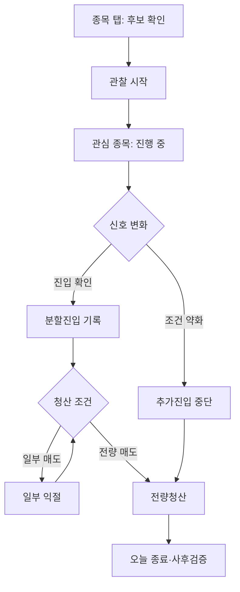

# FlowPulse 관심 종목 UI 명세

## 1. 문서 정보

| 항목 | 내용 |
|---|---|
| 화면명 | 관심 종목 |
| 하단 탭 위치 | 세 번째 탭 |
| 기준 시안 | 타임라인형 두 번째 시안 |
| 대상 | 모바일 웹·PWA·WebView |
| 기준 뷰포트 | 390px × 844px |
| 지원 테마 | 라이트·다크 |
| 문서 상태 | MVP 구현 기준 |

## 2. 화면 목적

관심 종목 탭은 단순 즐겨찾기 목록이 아니라 사용자가 `관찰 시작`을 누른 종목의 진행 상태를 관리하는 실행 화면이다.

사용자는 이 화면에서 다음 질문에 빠르게 답할 수 있어야 한다.

- 지금 확인해야 할 종목은 무엇인가?
- 종목이 관찰·진입·보유·청산 중 어느 단계인가?
- Flow Shift가 매수 또는 매도 방향으로 전환됐는가?
- 다음 확인 조건과 무효 조건은 무엇인가?
- 분할진입 또는 청산 내용을 기록해야 하는가?
- 장 마감 전에 청산 기록을 확인해야 하는가?

핵심 사용자 흐름은 다음과 같다.



## 3. 내비게이션 구조

| 순서 | 탭 | 역할 |
|---|---|---|
| 1 | Flow | 시장·업종·투자주체별 흐름 |
| 2 | 종목 | 후보 탐색·검색·신호 확인 |
| 3 | 관심 종목 | 관찰·진입·청산 진행 관리 |
| 4 | Feed | 신호 발생과 변화 피드 |
| 5 | Me | 기록·사후검증·설정·BYOK |

관심 종목 탭은 활성 상태에서 민트 계열 아이콘과 라벨로 표시한다.

## 4. 화면 전체 구조

위에서 아래 순서로 다음 영역을 배치한다.

1. 화면 제목과 데이터 상태
2. 1차 세그먼트: 진행 중·일반 관심·오늘 종료
3. 2차 상태 필터: 전체·진입 대기·보유·청산
4. 대표 관찰 종목 상세 카드
5. 나머지 관찰 종목 압축 목록
6. 장 마감·보유 기록 고정 안내
7. 하단 내비게이션

화면은 세로 스크롤을 지원한다. 상단 제목은 스크롤 시 축약형으로 고정할 수 있으나 MVP에서는 일반 스크롤을 허용한다.

## 5. 상단 헤더

### 5.1 표시 요소

```text
관심 종목
● 실시간 정상 · 14:23:18
```

| 요소 | 규칙 |
|---|---|
| 화면 제목 | `관심 종목` 고정 |
| 상태 점 | 정상 민트, 지연 주황, 오류 빨강, 장 종료 회색 |
| 데이터 문구 | 실시간 정상·수신 지연·연결 오류·장 종료 |
| 기준 시각 | 마지막 정상 수신 시각 |

### 5.2 상태별 문구

| 데이터 상태 | 문구 | 화면 처리 |
|---|---|---|
| 정상 | 실시간 정상 | 모든 기능 정상 |
| 지연 | 데이터 수신 지연 | Confidence 옆 지연 표시 |
| 일부 누락 | 일부 수급 데이터 누락 | 신호를 참고 상태로 전환 |
| 연결 오류 | API 연결 오류 | 신규 신호 확정 중단 |
| 장 종료 | 장 종료 데이터 | 실시간 변화 표시 중단 |

데이터 오류가 발생하면 투자 신호보다 데이터 상태를 먼저 보여준다.

## 6. 1차 세그먼트

| 탭 | 내용 | 카운트 기준 |
|---|---|---|
| 진행 중 | 활성 관찰과 보유 기록 | 종료되지 않은 관찰 수 |
| 일반 관심 | 별표로 저장한 종목 | 단순 관심 등록 수 |
| 오늘 종료 | 당일 종료 기록 | 미진입 종료와 청산 완료 수 |

### 6.1 상호작용

- 탭을 누르면 해당 목록으로 즉시 전환한다.
- 선택 상태는 배경 면색과 굵은 글자로 표현한다.
- 탭 전환 시 스크롤 위치는 각 탭별로 유지한다.
- 앱 재진입 시 기본값은 `진행 중`이다.

## 7. 2차 상태 필터

진행 중 탭에서만 노출한다.

| 필터 | 포함 상태 |
|---|---|
| 전체 | 모든 활성 관찰 |
| 진입 대기 | 관찰 중·진입 확인 대기 |
| 보유 | 1~5차 진입·보유·일부 익절 |
| 청산 | Rally Exit·무효·당일청산 확인 |

필터는 가로 스크롤 가능한 칩 형태로 구현한다. 각 필터 오른쪽에 종목 수를 표시한다.

기본 선택은 `전체`다.

## 8. 대표 관찰 종목 선정

화면 상단에는 행동 우선순위가 가장 높은 종목 한 개를 상세 카드로 표시한다.

우선순위는 다음과 같다.

1. 데이터 연결 오류
2. 장 마감 임박 및 청산 기록 미확인
3. Rally Exit 확인
4. 무효 조건 충족
5. 추가진입 중단 조건
6. 진입 확인 조건 충족
7. 수급 급격한 약화
8. 신호 강화
9. 확인 대기
10. 관찰 유지

동일 우선순위에서는 최근 상태 변경 시각이 빠른 종목을 먼저 표시한다.

## 9. 대표 관찰 카드

### 9.1 기본 구성

대표 카드의 왼쪽에는 진행 타임라인, 오른쪽에는 핵심 지표를 표시한다.

```text
SK하이닉스                    +1.8%  보유
000660 · KOSPI               현재가 142,800원

관찰 시작  13:36        평균 단가    140,200원
3차 진입   14:02        Confidence   84/100
Rally Exit 14:21        Flow Shift   매수→매도
                         Persistence  매도 7분

[전량청산 기록] [일부 익절]
```

### 9.2 종목 헤더

| 요소 | 필수 | 설명 |
|---|---|---|
| 종목명 | 필수 | 한글 종목명 |
| 종목 코드 | 필수 | 6자리 코드 |
| 시장 | 필수 | KOSPI·KOSDAQ·NASDAQ 등 |
| 현재 수익률 | 보유 시 필수 | 평균 단가 기준 |
| 사용자 상태 | 필수 | 관찰·보유·일부 익절 등 |
| 현재가 | 필수 | 마지막 수신 가격 |

수익률과 당일 등락률을 혼동하지 않도록 수익률에는 `내 수익` 또는 문맥상 명확한 라벨을 제공한다.

### 9.3 진행 타임라인

타임라인은 사용자의 행동과 주요 신호 변화를 시간순으로 표시한다.

| 이벤트 | 색상 | 예시 |
|---|---|---|
| 관찰 시작 | 민트 | 관찰 시작 13:36 |
| 진입 기록 | 파랑 | 3차 진입 14:02 |
| 신호 강화 | 민트 | 매수 동조 강화 14:08 |
| 추가진입 중단 | 주황 | 추가진입 중단 14:15 |
| Rally Exit | 빨강 | Rally Exit 확인 14:21 |
| 전량청산 | 회색·민트 | 전량청산 14:26 |

대표 카드에는 최근 핵심 이벤트 최대 3개를 표시한다. 전체 이력은 카드 상세 화면에서 확인한다.

타임라인의 원과 선은 의미를 색상에만 의존하지 않도록 완료·현재·경고 아이콘 또는 선 형태를 함께 구분한다.

### 9.4 핵심 지표

대표 카드에는 다음 지표를 우선 노출한다.

| 지표 | 표현 예시 | 목적 |
|---|---|---|
| 평균 단가 | 140,200원 | 사용자 기준 가격 |
| Flow Confidence | 84/100 | 신호 신뢰도 |
| Flow Shift | 매수 → 매도 | 수급 방향 전환 |
| Flow Persistence | 매도 7분 | 현재 방향 지속 시간 |

상세 화면에서는 다음 지표를 추가 제공한다.

- Flow Sync
- Flow Divergence
- Flow Acceleration
- 투자주체별 최근 5분·15분 변화
- 프로그램 순매수/거래대금 비율
- 확인 조건과 무효 조건
- 반대 근거

## 10. 대표 카드 상태별 버튼

| 사용자·신호 상태 | 기본 버튼 | 보조 버튼 |
|---|---|---|
| 관찰 중 | 관찰 종료 | 상세 보기 |
| 진입 확인 대기 | 진입 기록 | 상세 보기 |
| 진입 확인 | 1차 진입 기록 | 근거 보기 |
| 1~4차 진입 | 추가진입 기록 | 상세 보기 |
| 5차 진입·보유 | 청산 기록 | 상세 보기 |
| 추가진입 중단 | 청산 기록 | 근거 보기 |
| Rally Exit | 전량청산 기록 | 일부 익절 |
| 일부 익절 | 잔여 전량청산 | 추가 익절 |
| 무효 | 종료 기록 | 근거 보기 |
| 청산 기록 미확인 | 청산 완료 기록 | 다음 날 보유 |

버튼은 주문을 실행하지 않고 사용자의 실제 행동을 기록한다.

## 11. 압축 관찰 목록

대표 종목 아래 나머지 종목을 한 개의 목록 표면 안에 행 단위로 표시한다. 개별 행마다 별도의 큰 카드나 그림자를 사용하지 않는다.

### 11.1 행 구성

```text
● 삼성전자    진입 확인 대기       Confidence 78  >
  005930      3개 중 2개

● NAVER      추가진입 중단         Confidence 72→54 >
  035420      프로그램 순매수 회복 필요
```

| 요소 | 설명 |
|---|---|
| 상태 레일·점 | 행 왼쪽에서 현재 상태 표시 |
| 종목명 | 첫 번째 정보 |
| 종목 코드·시장 | 보조 정보 |
| 현재 단계 | 진입 대기·보유·청산 등 |
| 진행 정보 | 확인 조건 2/3·3차 진입·12분 등 |
| Confidence | 현재 값 또는 변화 값 |
| 화살표 | 상세 진입 가능 표시 |

### 11.2 행 동작

- 행 전체를 누르면 해당 종목을 대표 카드 위치로 확장한다.
- 기존 대표 카드는 목록의 원래 위치로 축소된다.
- 대표 변경 후 상단으로 부드럽게 스크롤한다.
- 길게 누르기 동작은 사용하지 않는다.
- 추가 기능은 상세 화면의 더보기 메뉴에서 제공한다.

## 12. 상태 색상 규칙

| 상태 | 의미색 | 사용 위치 |
|---|---|---|
| 관찰 유지·정상 | 민트 | 상태 점·텍스트 |
| 진입 확인 대기 | 파랑 | 타임라인·상태 라벨 |
| 추가진입 중단·주의 | 주황 | 상태 레일·문구 |
| Rally Exit·무효 | 빨강 | 현재 이벤트·주 버튼 |
| 종료·비활성 | 회색 | 종료 상태·보조 정보 |

빨강은 중요한 청산·무효 상태에만 제한적으로 사용한다. 카드 전체를 강한 빨강으로 채우지 않는다.

## 13. 장 마감 고정 안내

하단 내비게이션 바로 위에 고정 표시한다.

```text
장 마감까지 57분 · 보유 기록 2
```

### 13.1 시간대별 동작

| 조건 | 표시 |
|---|---|
| 장 마감 60분 초과 | 기본 회색 안내 |
| 장 마감 60분 이내 | 주황 강조 |
| 당일청산 기준 시각 도달 | 빨강 강조·청산 확인 요청 |
| 장 종료 후 청산 미확인 | 청산 기록 미확인 |
| 보유 기록 없음 | 마감 시각만 표시하거나 숨김 |

안내 영역을 누르면 청산 확인이 필요한 종목만 필터링한다.

## 14. 일반 관심 탭

분할진입과 청산 진행을 추적하지 않는 단순 저장 종목을 표시한다.

### 14.1 행 정보

- 종목명·코드·시장
- 현재가와 당일 등락률
- 주요 투자주체의 현재 방향
- Flow Shift 상태
- Flow Confidence 또는 산출 대기

### 14.2 행 버튼

- 종목 상세
- 관찰 시작
- 관심 해제

`관찰 시작`을 누르면 현재 신호 스냅샷을 저장하고 진행 중 탭으로 이동한다.

## 15. 오늘 종료 탭

당일 종료된 관찰과 청산 기록을 표시한다.

### 15.1 종료 유형

- 미진입 종료
- 목표 수익 익절
- Rally Exit 종료
- 무효 조건 종료
- 손실 종료
- 사용자 직접 종료

### 15.2 행 정보

- 종목명
- 종료 유형
- 관찰 시간 또는 보유 시간
- 실현 수익률
- 진입 횟수
- 종료 이유
- 사후검증 상태

행을 누르면 사후검증 상세로 이동한다.

## 16. 바텀시트 명세

### 16.1 진입 기록

입력 항목:

- 진입 차수
- 진입 가격
- 수량
- 진입 시각
- 선택 메모

자동 계산:

- 총 보유 수량
- 평균 진입가
- 총 투입 금액
- 현재 수익률

버튼:

- 취소
- 진입 기록 저장

검증:

- 가격과 수량은 0보다 커야 한다.
- 진입 차수는 전략의 최대 횟수를 초과할 수 없다.
- 동일 체결 기록의 중복 저장을 경고한다.

### 16.2 일부 익절 기록

입력 항목:

- 매도 가격
- 매도 수량
- 매도 시각
- 매도 이유
- 선택 메모

자동 계산:

- 실현 손익
- 실현 수익률
- 잔여 수량
- 잔여 포지션 수익률

검증:

- 매도 수량은 잔여 수량보다 작아야 한다.
- 전량을 입력한 경우 전량청산 화면으로 전환한다.

### 16.3 전량청산 기록

입력 항목:

- 청산 가격
- 잔여 수량
- 청산 시각
- 청산 이유
- 선택 메모

자동 계산:

- 총 실현 손익
- 총 실현 수익률
- 총 보유 시간
- 진입·청산 횟수

저장 결과:

1. 사용자 상태를 전량청산으로 변경한다.
2. 진행 중 목록에서 제거한다.
3. 오늘 종료에 추가한다.
4. 사후검증 기록을 생성한다.

### 16.4 관찰 종료 확인

선택 항목:

- 신호 약화
- 무효 조건 충족
- 관심 해제
- 진입하지 않음
- 사용자 직접 종료

진입 기록이 존재하면 단순 관찰 종료 대신 청산 여부를 먼저 확인한다.

## 17. 상세 화면

관찰 카드 또는 목록 행을 눌렀을 때 종목 관찰 상세로 이동한다.

상세 화면에는 다음을 표시한다.

- 현재 단계와 사용자 진행 상태
- 전체 관찰 타임라인
- Flow Shift·Sync·Confidence·Divergence·Persistence·Acceleration
- 프로그램·외국인·기관·개인 수급
- 가격과 수급 차트
- 확인 조건
- 무효 조건
- 추가진입 중단 조건
- Rally Exit 조건
- 유리한 근거와 반대 근거
- 진입·익절·청산 기록
- AI 해설

## 18. 상태 모델

### 18.1 신호 상태

```text
CANDIDATE
WAITING_CONFIRMATION
ENTRY_CONFIRMED
STRENGTHENING
WEAKENING
ADD_ENTRY_STOP
RALLY_EXIT_PENDING
RALLY_EXIT_CONFIRMED
INVALIDATED
ENDED
```

### 18.2 사용자 진행 상태

```text
OBSERVING
ENTRY_1
ENTRY_2
ENTRY_3
ENTRY_4
ENTRY_5
HOLDING
PARTIAL_EXIT
FULL_EXIT
ENDED_WITHOUT_ENTRY
EXIT_UNCONFIRMED
```

신호 상태와 사용자 진행 상태는 별도 필드로 관리한다. 앱은 신호 상태만으로 사용자의 실제 매수·매도를 추정하지 않는다.

## 19. 주요 상태 전환

| 발생 이벤트 | 이전 상태 | 변경 상태 | UI 처리 |
|---|---|---|---|
| 관찰 시작 | 없음 | OBSERVING | 진행 중에 추가 |
| 진입 조건 충족 | WAITING_CONFIRMATION | ENTRY_CONFIRMED | 파랑 강조·알림 |
| 진입 기록 | OBSERVING·ENTRY_N | ENTRY_1~5 | 타임라인 추가 |
| 최근 수급 약화 | ENTRY_N·HOLDING | ADD_ENTRY_STOP | 주황 강조 |
| 매수→매도 전환 | HOLDING | RALLY_EXIT_PENDING | 청산 필터 이동 |
| Rally Exit 확인 | HOLDING | RALLY_EXIT_CONFIRMED | 대표 우선순위 상승 |
| 일부 익절 | HOLDING | PARTIAL_EXIT | 잔여 수량 표시 |
| 전량청산 | HOLDING·PARTIAL_EXIT | FULL_EXIT | 오늘 종료 이동 |
| 무효 조건 충족 | 활성 상태 | INVALIDATED | 빨강 강조 |
| 미진입 종료 | OBSERVING | ENDED_WITHOUT_ENTRY | 오늘 종료 이동 |

## 20. 알림과 딥링크

| 알림 | 이동 위치 |
|---|---|
| 진입 확인 조건 충족 | 관심 종목 해당 대표 카드 |
| Flow Shift 발생 | 해당 종목 상세의 Flow Shift |
| 추가진입 중단 | 해당 종목 대표 카드 |
| Rally Exit | 해당 종목 대표 카드 |
| 무효 조건 | 해당 종목 상세의 무효 근거 |
| 장 마감 임박 | 청산 필터 |
| 데이터 오류 | 상단 데이터 상태 안내 |

동일한 상태가 유지되는 동안 반복 알림을 보내지 않는다. 상태가 해제된 후 다시 충족될 때 재알림한다.

## 21. 빈 화면과 오류 화면

### 21.1 진행 중 없음

```text
현재 관찰 중인 종목이 없습니다.
종목 탭에서 신호를 확인하고 관찰 시작을 눌러보세요.

[신호 종목 보러 가기]
```

### 21.2 일반 관심 없음

```text
아직 일반 관심 종목이 없습니다.
종목을 검색하거나 관심 등록을 눌러보세요.

[종목 검색]
```

### 21.3 데이터 연결 오류

```text
실시간 데이터를 불러올 수 없습니다.
현재 신호는 최신 상태가 아닐 수 있습니다.

[연결 상태 확인] [다시 시도]
```

마지막으로 정상 수신한 데이터가 있으면 기준 시각과 함께 읽기 전용으로 표시한다.

## 22. 라이트·다크 모드

### 22.1 의미 기반 토큰

구현에서는 고정 색상값보다 의미 기반 토큰을 사용한다.

| 토큰 | 라이트 | 다크 | 용도 |
|---|---|---|---|
| background | 밝은 회백색 | 짙은 녹흑색 | 화면 배경 |
| surface | 흰색 | 짙은 청록 표면 | 카드·목록 |
| surface-subtle | 옅은 회색 | 밝기가 한 단계 높은 녹흑색 | 필터·고정 안내 |
| text-primary | 짙은 남회색 | 밝은 회백색 | 제목·수치 |
| text-secondary | 중간 회색 | 밝은 회색 | 보조 정보 |
| border | 옅은 회색 | 반투명 밝은 회색 | 구분선 |
| brand | 민트·청록 | 밝은 민트 | 활성·정상 |
| info | 파랑 | 밝은 파랑 | 진입 확인 |
| warning | 주황 | 밝은 주황 | 주의·추가진입 중단 |
| danger | 코럴 빨강 | 밝은 코럴 | Rally Exit·무효 |

### 22.2 테마 원칙

- 두 테마는 동일한 정보 구조와 컴포넌트 크기를 사용한다.
- 다크 모드에서 순수 검정과 순수 흰색의 과도한 대비를 피한다.
- 경고 카드 전체를 강한 색으로 채우지 않고 경계·라벨·버튼에 의미색을 적용한다.
- 비활성 텍스트도 접근 가능한 대비를 확보한다.
- 상승·하락 색상과 매수·매도 색상은 별도 라벨로 의미를 보완한다.

## 23. 레이아웃·컴포넌트 규칙

| 항목 | 권장값 |
|---|---|
| 화면 좌우 여백 | 16px |
| 섹션 간격 | 16~20px |
| 카드 내부 여백 | 16px |
| 행 최소 높이 | 56px |
| 버튼 최소 높이 | 44px |
| 카드 모서리 | 10~12px |
| 칩 모서리 | 8~10px |
| 터치 영역 | 최소 44×44px |
| 본문 글자 | 14~16px |
| 보조 글자 | 12~13px |
| 제목 | 20~24px |

모바일 너비가 좁아지면 대표 카드의 타임라인과 지표 영역을 위아래로 배치한다. 글자를 지나치게 축소하지 않는다.

## 24. 접근성

- 색상만으로 상태를 전달하지 않는다.
- 모든 아이콘에 접근성 라벨을 제공한다.
- 수익률과 가격은 스크린리더가 자연스럽게 읽을 수 있는 문자열을 제공한다.
- 필터와 탭에는 선택 상태를 전달한다.
- 동적 상태 변경은 필요한 경우 접근성 라이브 영역으로 알린다.
- 모션 감소 설정에서는 대표 카드 전환 애니메이션을 제거한다.
- 숫자는 자릿수 구분을 유지한다.

## 25. 로딩·갱신 정책

- 최초 진입 시 헤더와 탭 구조는 즉시 표시한다.
- 카드 영역은 실제 크기와 유사한 스켈레톤을 표시한다.
- 실시간 가격 갱신만으로 목록 순서를 계속 변경하지 않는다.
- 행동 우선순위가 바뀐 경우에만 대표 카드를 교체한다.
- 사용자가 기록 바텀시트를 작성 중이면 실시간 갱신으로 입력값을 덮어쓰지 않는다.
- 저장 버튼은 중복 제출을 방지한다.

## 26. 이벤트 로깅

| 이벤트 | 주요 속성 |
|---|---|
| watch_tab_view | selected_segment, active_count |
| watch_filter_select | filter_name, result_count |
| watch_item_expand | symbol, signal_state, user_state |
| entry_record_open | symbol, entry_step |
| entry_record_save | symbol, entry_step |
| partial_exit_save | symbol, reason |
| full_exit_save | symbol, reason, realized_return |
| observation_end | symbol, reason, entered |
| close_warning_open | remaining_minutes, holding_count |
| post_validation_open | symbol, result_type |

금액·계좌번호 등 불필요한 개인정보는 분석 이벤트에 포함하지 않는다.

## 27. MVP 범위

### 27.1 P0

- 진행 중·일반 관심·오늘 종료
- 전체·진입 대기·보유·청산 필터
- 대표 관찰 카드와 타임라인
- 압축 관찰 목록
- Flow Shift·Confidence·Persistence 표시
- 진입 기록
- 일부 익절 기록
- 전량청산 기록
- 추가진입 중단
- Rally Exit
- 장 마감 안내
- 데이터 상태
- 라이트·다크 모드
- 알림 딥링크
- 사후검증 연결

### 27.2 P1

- 사용자 직접 정렬
- 복수 전략 동시 관찰
- 체결 내역 자동 입력
- 종목별 알림 설정
- AI 현재 상태 해설
- 관찰 메모

### 27.3 제외

- 자동 주문
- 무확인 주문 실행
- 수익 보장 표현
- 사용자가 기록하지 않은 체결 추정

## 28. 개발 완료 조건

- 종목 탭에서 `관찰 시작`을 누르면 관심 종목의 진행 중에 중복 없이 추가된다.
- 알림을 누르면 해당 종목이 대표 카드로 열린다.
- 상태 필터별 종목 수와 실제 목록이 일치한다.
- 대표 카드는 행동 우선순위에 따라 선정된다.
- 진입·일부 익절·전량청산 기록 후 평균가·수량·손익이 정확히 갱신된다.
- 전량청산 종목은 오늘 종료와 사후검증으로 이동한다.
- 데이터 지연·오류 상태에서 최신 신호처럼 표현하지 않는다.
- 라이트·다크 모드에서 정보·상태·버튼 의미가 동일하다.
- 390px 기준으로 텍스트 잘림과 가로 스크롤이 발생하지 않는다.
- 주요 버튼의 터치 영역이 최소 44px을 충족한다.
- 앱이 매수·매도 주문을 실행하거나 단정적인 투자 명령을 표시하지 않는다.

## 29. 최종 정의

두 번째 종목 탭은 `무엇을 관찰할 것인가`를 결정하는 탐색 화면이다.

세 번째 관심 종목 탭은 `관찰하기로 결정한 종목을 어떻게 끝까지 관리할 것인가`를 다루는 실행 화면이다.

관심 종목 탭의 핵심은 많은 지표를 나열하는 것이 아니라 다음 세 가지를 즉시 보여주는 것이다.

1. 지금 가장 먼저 확인할 종목
2. 해당 종목의 현재 진행 단계
3. 사용자가 기록하거나 확인해야 할 다음 행동
