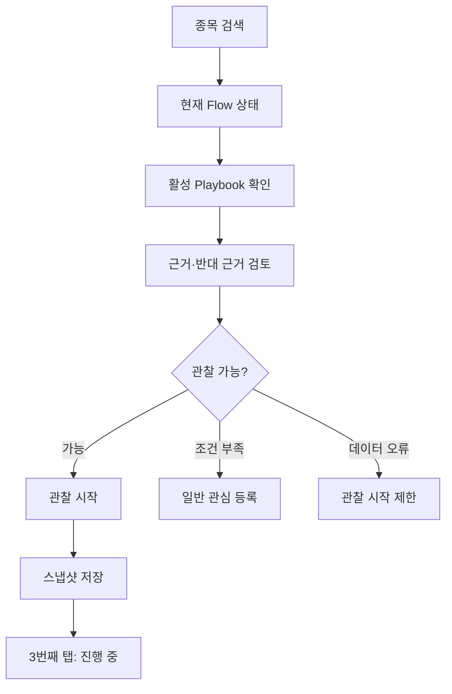
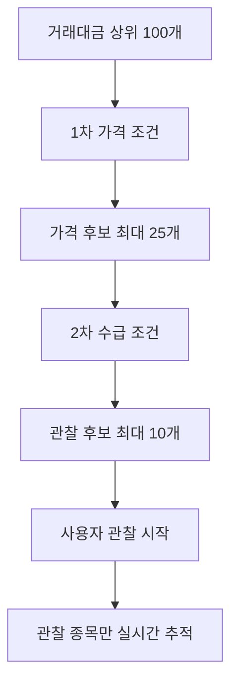

# FlowPulse 2번째 탭 종목 분석 UI 수정 명세

## 1. 문서 정보

| 항목 | 내용 |
|---|---|
| 화면명 | 종목 분석 |
| 하단 탭 위치 | 두 번째 탭 |
| 대상 화면 | 현재 구현된 종목 검색·분석 화면 |
| 후속 화면 | 세 번째 관심 종목 탭 |
| 대상 플랫폼 | 모바일 웹·PWA·WebView |
| 지원 테마 | 라이트·다크 |
| 문서 상태 | 기존 구현 수정 기준 |

## 2. 문서 목적

두 번째 종목 탭을 단순 데이터 조회 화면에서 `관찰할 가치가 있는 종목인지 판단하고 관찰을 시작하는 화면`으로 수정한다.

두 번째 탭과 세 번째 탭의 역할은 다음과 같이 분리한다.

| 탭 | 핵심 질문 | 역할 |
|---|---|---|
| 종목 | 이 종목을 관찰할 것인가? | 검색·신호 판단·근거 검토·관찰 시작 |
| 관심 종목 | 관찰 중인 종목을 어떻게 관리할 것인가? | 변화 추적·진입 기록·청산 기록·사후검증 |

핵심 전환은 `관찰 시작`이다.



## 3. 현재 구현 화면 진단

첨부된 현재 화면을 기준으로 확인한 수정 필요 사항이다.

### 3.1 유지할 요소

- 상단 데이터 수집 상태와 기준 시각
- 종목명·종목코드 검색
- 종목명·코드·시장·현재가·등락률
- 판단 근거·수급 분석·가격 수급 차트의 3개 탭
- 긍정 근거와 반대 근거의 동시 제공
- 확인·추가 확인·무효 조건 구분
- 다크 모드의 테두리 중심 카드 체계

### 3.2 핵심 문제

| 문제 | 현재 화면에서 보이는 현상 | 영향 |
|---|---|---|
| 판단과 CTA 충돌 | `주의 관찰`인데 `관찰 시작`이 강한 주 버튼 | 사용자가 확인 조건 충족으로 오해할 수 있음 |
| 근거 의미 충돌 | 프로그램 누적 순매도 값이 긍정 근거에 표시 | 데이터 해석 신뢰도 저하 |
| 신호 정체성 부족 | Playbook 이름과 Signal Phase가 없음 | 무엇을 관찰하는지 불명확 |
| 필수 Flow 지표 부족 | Shift·Confidence 외 핵심 지표가 없음 | 수급 방향·동조·지속 여부 판단 어려움 |
| Confidence 중복 | 상단과 판단 근거에서 같은 값 반복 | 제한된 모바일 공간 낭비 |
| 관심과 관찰 혼동 | 별표와 관찰 시작의 차이가 설명되지 않음 | 단순 저장과 능동 추적을 혼동 |
| 관찰 이후 상태 없음 | 관찰 시작 후 CTA 변화와 이동 규칙이 없음 | 중복 관찰 생성 가능 |
| 다음 조건의 진행률 부족 | 조건 텍스트만 있고 충족 개수가 상단에 없음 | 관찰 시작 판단이 느림 |
| 데이터 상태와 신호 상태 혼합 | Confidence가 데이터·신호 신뢰도로만 표기 | 상승 확률로 오해할 위험 |
| 화면 정보 우선순위 약함 | 현재 판단, 근거 카드, 판단 기준이 반복 | 가장 중요한 다음 행동이 묻힘 |

### 3.3 접근성 확인 한계

첨부 화면만으로 실제 키보드 포커스, 스크린리더 라벨, 터치 영역, 동적 갱신 알림은 확인할 수 없다. 구현 단계에서 별도 검증해야 한다.

## 4. 수정 후 화면의 핵심 원칙

1. 종목의 현재 상태를 한 문장으로 설명한다.
2. 활성 Playbook과 Signal Phase를 명확히 표시한다.
3. 관찰 가능 여부와 진입 확인 여부를 구분한다.
4. 원본 데이터·계산 지표·AI 해설을 구분한다.
5. 긍정 근거와 반대 근거의 의미를 수치 방향과 일치시킨다.
6. `관심 등록`과 `관찰 시작`을 별도 행동으로 제공한다.
7. 관찰 시작 시 신호 스냅샷과 조건을 저장한다.
8. 관찰 시작 후 세 번째 관심 종목 탭에서 진행을 관리한다.
9. 앱은 매수·매도 주문을 실행하거나 명령하지 않는다.

## 5. 수정 후 화면 구조

모바일 화면의 권장 순서는 다음과 같다.

1. 화면 제목·데이터 상태
2. 종목 검색
3. 종목 고정 헤더
4. 활성 Playbook 요약 카드
5. 관심 등록·관찰 시작 행동 영역
6. 상세 탭
7. 판단 근거
8. 수급 분석
9. 가격·수급 차트
10. 고정 하단 행동 영역

현재 화면의 큰 판단 카드와 하단 판단 카드가 같은 내용을 반복하므로 하나의 `활성 Playbook 요약 카드`로 통합한다.

## 6. 상단 헤더

### 6.1 화면 제목

```text
STOCK ANALYSIS
종목 분석
```

영문 보조 제목은 기존 디자인과 일관성을 위해 유지할 수 있다. 한글 제목을 주요 접근성 제목으로 사용한다.

### 6.2 데이터 상태

```text
● 실시간 정상 · 10:24:18
```

| 상태 | 색상 | 문구 | 신호 처리 |
|---|---|---|---|
| 정상 | 민트 | 실시간 정상 | 전체 기능 사용 |
| 지연 | 주황 | 수신 지연 | 신호 참고 상태 |
| 일부 누락 | 주황 | 일부 데이터 누락 | Confidence 하향 또는 산출 제한 |
| 연결 오류 | 빨강 | API 연결 오류 | 관찰 시작 제한 |
| 장 종료 | 회색 | 장 종료 | 실시간 조건 갱신 중단 |

마지막 수신 시각은 항상 표시한다.

## 7. 종목 검색

### 7.1 입력

- 종목명
- 종목코드
- 초성 검색은 P1

### 7.2 검색 상태

- 최근 검색 종목
- 검색 결과
- 검색 결과 없음
- 거래정지·관리종목
- 데이터 미지원 종목

### 7.3 종목 전환 정책

다른 종목을 선택하면 다음을 초기화한다.

- 열린 상세 탭
- 펼쳐진 근거
- 임시 관찰 설정
- 선택한 Playbook

사용자가 입력 중인 기록이 있다면 종목 전환 전에 확인한다.

## 8. 종목 고정 헤더

```text
삼성전자 · 005930 · KOSPI          ☆
230,000원  ▼0.43%          실시간 10:24:18
```

### 8.1 관심 아이콘 상태

| 상태 | 아이콘 | 동작 |
|---|---|---|
| 미등록 | 빈 별 | 일반 관심 등록 |
| 등록 | 채운 별 | 일반 관심 해제 확인 |
| 관찰 중 | 별 + 관찰 점 | 관심 종목의 관찰 카드로 이동 |

### 8.2 관심 등록과 관찰 시작

| 기능 | 의미 | 저장 정보 |
|---|---|---|
| 관심 등록 | 종목을 나중에 다시 확인 | 종목 ID·등록 시각 |
| 관찰 시작 | 특정 신호의 진행 추적 | 신호·조건·지표·데이터 스냅샷 |

별표를 누르는 것만으로 Playbook 관찰이나 알림을 시작하지 않는다.

## 9. 활성 Playbook 요약 카드

기존 `현재 판단` 카드를 다음 구조로 교체한다.

### 9.1 예시

```text
PROGRAM DIP REVERSAL                 주의 관찰
삼성전자 · 반전 확인 대기

프로그램 매수 흐름이 약해져 반전 조건을 추가로 확인해야 합니다.

Flow Shift          매수 → 매도 전환
Flow Sync           -32 · 약한 매도 동조
Flow Confidence     78/100
Flow Divergence     가격↓ / 프로그램↓
Flow Persistence    매도 7분
Flow Acceleration   최근 5분 매도 강화

확인 조건 3개 중 2개 충족
[■■□□□□]

[일반 관심 등록] [관찰 시작]
```

### 9.2 필수 정보

| 영역 | 내용 |
|---|---|
| 신호 정체성 | Playbook 이름·버전 |
| 현재 단계 | 후보·반전 확인 대기·확인·약화·무효 |
| 한 문장 판단 | 현재 상태를 사실 기반으로 요약 |
| 핵심 지표 | Shift·Sync·Confidence·Divergence·Persistence·Acceleration |
| 조건 진행 | 충족 개수·전체 개수 |
| 다음 조건 | 아직 충족되지 않은 가장 중요한 조건 |
| 무효 조건 | 가장 가까운 무효 조건 |
| 행동 | 관심 등록·관찰 시작 또는 관찰 중 이동 |

### 9.3 Flow Confidence 표기

`Confidence`만 단독 표기하지 않고 `Flow Confidence`를 사용한다.

고정 보조 문구:

> 데이터와 신호의 신뢰도이며 상승 또는 수익 확률이 아닙니다.

동일한 Confidence 값은 요약 카드 안에서 한 번만 노출한다.

## 10. 관찰 가능 상태

관찰 가능 여부와 진입 확인 여부는 서로 다른 상태다.

| 상태 | 의미 | 관찰 시작 |
|---|---|---|
| 데이터 불충분 | 필수 데이터 부족 | 제한 |
| 신호 없음 | 활성 Playbook 없음 | 일반 관심만 가능 |
| 후보 | 초기 조건 일부 충족 | 가능 |
| 확인 대기 | 추가 확인 필요 | 가능 |
| 진입 확인 | 모든 확인 조건 충족 | 가능 |
| 약화 | 신호 약화 중 | 경고 후 가능 |
| 무효 | 무효 조건 충족 | 신규 관찰 제한 |
| 이미 관찰 중 | 활성 관찰 존재 | 기존 관찰로 이동 |

`관찰 시작`은 매수 추천이나 진입 확정을 의미하지 않는다.

## 11. CTA 상태 명세

### 11.1 일반 상태

```text
[일반 관심 등록] [관찰 시작]
```

### 11.2 이미 관심 등록

```text
[관심 등록됨] [관찰 시작]
```

### 11.3 이미 관찰 중

```text
[관찰 중 · 관심 종목 보기]
```

### 11.4 데이터 오류

```text
[일반 관심 등록] [관찰 시작 불가]
필수 수급 데이터가 없어 관찰을 시작할 수 없습니다.
```

### 11.5 무효 상태

```text
[일반 관심 등록] [현재 신호 관찰 불가]
무효 조건이 충족되어 현재 Playbook 관찰을 시작하지 않습니다.
```

버튼 비활성화만 사용하지 않고 제한 이유를 텍스트로 제공한다.

## 12. 관찰 시작 흐름

### 12.1 관찰 시작 바텀시트

`관찰 시작`을 누르면 바로 주문이나 진입 기록으로 이동하지 않는다. 다음 내용을 확인하는 바텀시트를 표시한다.

```text
관찰 시작

삼성전자 · Program Dip Reversal
현재 단계: 반전 확인 대기

확인할 조건
✓ 5분 Envelope 하단 재진입
✓ 프로그램 최근 5분 순매수 유지
○ 직전 5분봉 고가 돌파

무효 조건
- 당일 저점 이탈
- 프로그램 최근 5분 순매도 전환

알림
[✓] 진입 확인
[✓] 무효 조건
[✓] Rally Exit

[취소] [관찰 시작]
```

### 12.2 저장할 스냅샷

- 종목 코드·시장
- Playbook ID·이름·버전
- Signal Phase
- 관찰 대상 투자주체
- 현재가·등락률
- Flow Shift
- Flow Sync
- Flow Confidence
- Flow Divergence
- Flow Persistence
- Flow Acceleration
- 프로그램·외국인·기관·개인 수급
- 최근 5분·15분 변화
- 확인 조건과 충족 상태
- 무효 조건
- 데이터 제공자·상태·기준 시각
- 관찰 시작 시각
- 선택한 알림

### 12.3 완료 처리

1. 활성 관찰 중복 여부를 다시 확인한다.
2. 관찰 인스턴스를 생성한다.
3. 신호 스냅샷을 저장한다.
4. 선택한 알림을 활성화한다.
5. 세 번째 관심 종목 탭의 `진행 중`으로 이동한다.
6. 방금 추가한 종목을 대표 카드로 연다.

완료 메시지:

> 관심 종목에서 관찰을 시작했습니다.

## 13. 중복 관찰 처리

MVP에서는 종목당 활성 관찰 한 개만 허용한다.

이미 관찰 중인 경우 새 관찰을 생성하지 않는다.

```text
이미 관찰 중인 종목입니다.
[관심 종목에서 보기]
```

다른 Playbook으로 변경하려면 기존 관찰 종료 후 다시 시작한다.

## 14. 상세 탭 구조

현재 3개 탭은 유지하되 역할을 명확히 한다.

| 탭 | 핵심 질문 | 기본 내용 |
|---|---|---|
| 판단 근거 | 왜 이 상태인가? | 판단·조건·근거·반대 근거 |
| 수급 분석 | 누가 어느 방향으로 움직이는가? | 주체별 수급과 Flow 지표 |
| 가격·수급 차트 | 언제 전환됐는가? | 가격과 수급·신호 이벤트 |

기본 선택은 `판단 근거`다.

## 15. 판단 근거 탭

### 15.1 섹션 순서

1. 현재 판단
2. 조건 진행률
3. 확인된 근거
4. 반대 근거
5. 판단 기준
6. 원본 데이터 기준 시각

### 15.2 현재 판단

상단 Playbook 카드와 같은 문장을 반복하지 않는다.

이 영역에서는 변화 이유를 보완한다.

```text
직전 상태: 매수 유지
현재 상태: 매수 → 매도 전환 탐색
변경 시각: 10:21

최근 5분 프로그램 수급이 순매도로 전환되어
반전 확인 조건의 신뢰도가 낮아졌습니다.
```

### 15.3 조건 진행률

| 조건 | 상태 | 기준값 | 현재값 |
|---|---|---|---|
| 5분 Envelope 하단 재진입 | 충족 | 하단선 상회 | +0.2% |
| 프로그램 최근 5분 순매수 | 미충족 | 0 초과 | -12.4억 |
| 직전 5분봉 고가 돌파 | 대기 | 231,000원 | 230,000원 |

단순 `확인·추가 확인·무효` 텍스트보다 현재값과 기준값을 함께 표시한다.

### 15.4 확인된 근거

긍정적 의미가 확인된 항목만 포함한다.

예시:

- 5분 Envelope 하단 재진입
- 직전 저점 미이탈
- 기관 순매수 유지

프로그램 누적 값이 순매도라면 `긍정 근거`에 넣지 않는다. 다만 누적 순매도 규모가 감소 중이라면 다음처럼 방향을 명시한다.

> 프로그램 누적 순매도 -7,484.8억원, 최근 5분 순매도 규모 축소

### 15.5 반대 근거

현재 Playbook을 약화하거나 무효에 가깝게 만드는 데이터를 표시한다.

- 프로그램 최근 5분 순매도 전환
- 외국인 순매도 지속
- 거래량 회복 미확인
- 직전 5분봉 고가 미돌파
- 당일 저점 접근

### 15.6 판단 기준

| 구분 | 조건 |
|---|---|
| 확인 | 5분 Envelope 하단 재진입 |
| 추가 확인 | 직전 5분봉 고가 돌파 |
| 무효 | 당일 저점 이탈 또는 프로그램 순매도 전환 |

조건식 버전과 기준 시간 프레임을 표시한다.

## 16. 수급 분석 탭

### 16.1 상단 Flow 요약

| 지표 | 표시 |
|---|---|
| Flow Shift | 프로그램 매수 → 매도 전환 |
| Flow Sync | -32 · 약한 매도 동조 |
| Flow Confidence | 78/100 |
| Flow Divergence | 가격↓ / 프로그램↓ |
| Flow Persistence | 매도 7분 |
| Flow Acceleration | 최근 5분 매도 강화 |

### 16.2 투자주체별 수급

| 주체 | 최근 5분 | 최근 15분 | 당일 누적 | 현재 방향 |
|---|---:|---:|---:|---|
| 프로그램 | -12.4억 | -41.8억 | -7,484.8억 | 매도 전환 |
| 외국인 | -56,357주 | -181,200주 | -1,737,367주 | 매도 유지 |
| 기관 | +36,604주 | +91,300주 | +664.1억 | 약한 매수 |
| 개인 | +633,738주 | +1,102,000주 | +381.3억 | 매수 유지 |

단위가 금액과 수량 중 무엇인지 행 또는 열에서 명확히 표시한다.

### 16.3 원본과 계산 지표 분리

- 원본: 체결·순매수·거래대금·가격
- 계산: Shift·Sync·Confidence·Divergence·Persistence·Acceleration
- 해석: 현재 판단과 AI 설명

세 영역을 시각적으로 구분한다.

## 17. 가격·수급 차트 탭

### 17.1 기본 레이어

- 가격
- 거래량
- 프로그램
- 외국인
- 기관
- 개인

### 17.2 이벤트 마커

- 관찰 시작
- 매도 → 매수 Shift
- 진입 확인
- 신호 약화
- 매수 → 매도 Shift
- Rally Exit
- 무효 조건

사용자가 아직 관찰을 시작하지 않았다면 `관찰 시작` 마커는 표시하지 않는다.

### 17.3 상호작용

- 마커 선택 시 해당 시점 근거 표시
- 길게 누르면 가격·수급 값 표시
- 시간 프레임 변경 시 기준 조건도 함께 변경
- 실시간과 과거 Replay를 명확히 구분

## 18. 종목별 신호가 여러 개인 경우

한 종목에 여러 Playbook이 활성화될 수 있다.

요약 카드 상단에 Playbook 선택기를 제공한다.

```text
[Program Dip Reversal ▼]
```

정렬 순서:

1. 데이터 오류·무효 위험
2. Rally Exit
3. 진입 확인
4. 확인 대기
5. 초기 후보

MVP 관찰 시작은 선택한 Playbook 한 개에 대해서만 생성한다.

## 19. 관찰 시작 전후 화면 변화

| 요소 | 시작 전 | 시작 후 |
|---|---|---|
| CTA | 관찰 시작 | 관찰 중·관심 종목 보기 |
| 상태 | 후보·확인 대기 | 관찰 시작 시각 표시 |
| 별표 | 관심 여부 | 관찰 점 추가 |
| 알림 | 선택 가능 | 활성 알림 요약 |
| 차트 | 신호 마커 | 관찰 시작 마커 추가 |
| 중복 클릭 | 관찰 생성 | 기존 관찰로 이동 |

## 20. 고정 하단 행동 영역

모바일에서는 사용자가 상세 근거를 읽은 후에도 행동에 접근할 수 있도록 하단 CTA를 고정할 수 있다.

### 20.1 관찰 시작 전

```text
[관심 등록] [관찰 시작]
```

### 20.2 관찰 시작 후

```text
[관찰 중 · 관심 종목 보기]
```

### 20.3 구현 규칙

- 콘텐츠를 가리지 않도록 하단 여백을 확보한다.
- 스크롤 방향에 따라 과도하게 숨기거나 나타나지 않는다.
- 키보드가 열리면 검색 결과를 방해하지 않도록 축소한다.
- 데이터 오류 시 제한 이유를 함께 표시한다.

## 21. 표현 정책

### 21.1 사용하지 않는 표현

- 지금 매수하세요.
- 매수 확정입니다.
- 무조건 반등합니다.
- 수익 확률 78%입니다.
- 지금 전량 매도하세요.

### 21.2 사용하는 표현

- 반전 확인 대기
- 확인 조건 3개 중 2개 충족
- 프로그램 매수 → 매도 전환
- 추가 확인이 필요합니다.
- 무효 조건이 충족됐습니다.
- 관심 종목에서 관찰을 시작합니다.
- 데이터와 신호의 신뢰도이며 상승 확률이 아닙니다.

## 22. 라이트·다크 모드

### 22.1 의미 기반 토큰

| 의미 | 라이트 | 다크 |
|---|---|---|
| 배경 | 밝은 회백색 | 짙은 녹흑색 |
| 기본 표면 | 흰색 | 짙은 청록 표면 |
| 보조 표면 | 옅은 회색 | 한 단계 밝은 녹흑색 |
| 주요 텍스트 | 짙은 남회색 | 밝은 회백색 |
| 보조 텍스트 | 중간 회색 | 밝은 회색 |
| 정상·관찰 | 민트 | 밝은 민트 |
| 진입 확인 | 파랑 | 밝은 파랑 |
| 주의 | 주황 | 밝은 주황 |
| 무효·위험 | 코럴 빨강 | 밝은 코럴 |

### 22.2 규칙

- 동일한 상태는 두 테마에서 같은 의미색을 사용한다.
- 다크 모드에서 낮은 대비의 회색 텍스트를 피한다.
- 위험 상태를 색상만으로 전달하지 않는다.
- 카드 구분은 그림자보다 테두리와 표면 밝기로 처리한다.
- 상승·하락과 매수·매도에는 방향 텍스트 또는 화살표를 함께 제공한다.

## 23. 접근성

- 검색·별표·탭·CTA의 터치 영역은 최소 44×44px을 확보한다.
- 탭과 Playbook 선택기에 선택 상태를 제공한다.
- 실시간 값 변경을 모두 읽어주지 않고 중요 상태 전환만 알린다.
- Confidence는 스크린리더에서 `Flow Confidence 78점, 100점 만점`으로 읽는다.
- `매수에서 매도로 전환`처럼 화살표의 의미를 텍스트로 제공한다.
- 비활성 CTA에는 비활성 이유를 연결한다.
- 모션 감소 설정에서는 숫자 점멸과 카드 이동 애니메이션을 제거한다.

## 24. 로딩·오류·빈 상태

### 24.1 로딩

- 종목 헤더를 먼저 표시한다.
- Playbook 카드와 상세 영역에는 실제 크기와 유사한 스켈레톤을 사용한다.
- 이전 종목 데이터가 새 종목에 잠시 노출되지 않도록 한다.

### 24.2 활성 신호 없음

```text
현재 활성화된 Playbook 신호가 없습니다.
일반 관심 종목으로 저장하고 변화를 확인할 수 있습니다.

[관심 등록]
```

### 24.3 필수 데이터 누락

```text
프로그램 수급 데이터가 누락되어
현재 Flow Shift를 확정할 수 없습니다.

[연결 상태 확인]
```

### 24.4 검색 결과 없음

```text
일치하는 종목을 찾을 수 없습니다.
종목명 또는 6자리 코드를 확인해 주세요.
```

## 25. 이벤트 로깅

| 이벤트 | 주요 속성 |
|---|---|
| stock_search | query_type, result_count |
| stock_select | symbol, source |
| playbook_select | symbol, playbook_id, phase |
| evidence_tab_select | tab_name |
| condition_expand | condition_type |
| favorite_toggle | symbol, enabled |
| observation_sheet_open | symbol, playbook_id, phase |
| observation_start | symbol, playbook_id, confidence |
| observation_blocked | symbol, reason |
| active_observation_open | symbol, observation_id |

계좌번호와 개인 식별 정보는 분석 이벤트에 포함하지 않는다.

## 26. 데이터 계약

종목 분석 화면은 다음 데이터가 필요하다.

```ts
type StockAnalysisView = {
  symbol: string;
  name: string;
  market: string;
  price: number;
  changeRate: number;
  marketStatus: string;
  dataStatus: "NORMAL" | "STALE" | "PARTIAL" | "ERROR" | "CLOSED";
  lastUpdatedAt: string;
  isFavorite: boolean;
  activeObservationId?: string;
  activePlaybooks: PlaybookSummary[];
};

type PlaybookSummary = {
  playbookId: string;
  name: string;
  version: string;
  phase: string;
  actor: "PROGRAM" | "FOREIGN" | "INSTITUTION" | "INDIVIDUAL" | "MULTI";
  flowShift: string;
  flowSync: number | null;
  confidence: number | null;
  divergence: string | null;
  persistenceMinutes: number | null;
  acceleration: string | null;
  summary: string;
  confirmations: ConditionState[];
  invalidations: ConditionState[];
  observationEligibility: "ELIGIBLE" | "WARNING" | "BLOCKED";
  blockReason?: string;
};
```

## 27. 관찰 후보 자동 선별 파이프라인

두 번째 탭은 사용자가 종목을 직접 검색하는 기능과 함께, 현재 조건에서 관찰할 가치가 높은 종목을 미리 선별해 제공한다.

기능 명칭은 투자 종목을 직접 권유하는 의미의 `추천 종목`보다 `관찰 후보`를 사용한다.

확정 파이프라인은 다음과 같다.



### 27.1 단계별 범위

| 단계 | 입력 | 출력 | 처리 목적 | 권장 갱신 |
|---|---:|---:|---|---:|
| 모집단 선별 | 전체 시장 | 거래대금 상위 100개 | 유동성 있는 종목 확보 | 3분 |
| 1차 가격 필터 | 최대 100개 | 최대 25개 | 과매도·가격 반전 후보 축소 | 1분 |
| 2차 수급 필터 | 최대 25개 | 최대 10개 | 실제 수급 유입 후보 선별 | 1분 |
| 실시간 추적 | 사용자가 관찰 시작한 종목 | 활성 관찰 목록 | 확인·무효·Rally Exit 감시 | 실시간 |

상위 숫자는 목표 개수가 아니라 최대 개수다. 조건을 충족한 종목이 적으면 개수를 채우기 위해 기준을 낮추지 않는다.

### 27.2 거래대금 상위 100개 선별

거래대금 상위 종목은 당일 시장 상황에 따라 주기적으로 다시 구성한다.

기본 제외 대상:

- 거래정지 종목
- 관리종목
- 투자위험·투자경고 중 서비스 정책상 제외 대상으로 설정한 종목
- 정리매매 종목
- 가격 또는 거래대금 데이터 누락 종목
- Playbook 계산에 필요한 분봉 데이터가 부족한 종목
- 지나치게 낮은 가격 또는 유동성 기준 미달 종목

장 초반에는 순위 변동이 크므로 갱신 주기를 1~3분 범위로 단축할 수 있다. 일반 장중 기본값은 3분이다.

### 27.3 1차 가격 조건: 100개에서 최대 25개

1차 단계는 프로그램·외국인·기관의 종목별 상세 수급 API를 호출하기 전에 가격과 유동성만으로 후보를 줄인다.

Program Dip Reversal 기준 가격 조건:

- 당일 하락 또는 약세 구간
- 최소 거래대금 충족
- 허용된 당일 등락률 범위
- 급격한 갭 하락 위험 제외 또는 감점
- 30분 Envelope 하단 접근·이탈
- 5분 Envelope 하단 재진입 탐색
- 당일 저점과의 거리
- 직전 저점 유지 여부
- 최근 거래량 회복 여부
- VI·거래정지 등 거래 상태 정상

25개를 초과하면 다음 순서로 정렬한다.

1. 5분·30분 Envelope 조건 근접도
2. 당일 저점 유지 여부
3. 최근 가격 반전 징후
4. 거래량 회복 정도
5. 거래대금
6. 조건 발생 최신성

1차 가격 점수 예시:

```text
Price Candidate Score =
Envelope 근접도       30%
가격 반전 징후         25%
직전 저점 유지         15%
거래량 회복            15%
거래대금·유동성         10%
신호 최신성             5%
```

가중치는 초기 구현값이며 사후검증 결과에 따라 버전 관리한다.

### 27.4 2차 수급 조건: 25개에서 최대 10개

1차 필터를 통과한 최대 25개 종목에만 상세 수급 데이터를 조회하고 Flow 지표를 계산한다.

필수 수급 조건:

- 프로그램 당일 누적 순매수
- 프로그램 최근 5분·15분 순매수 변화
- 프로그램 순매수/거래대금 비율
- 외국인 수급 방향
- 기관 수급 방향
- 개인 수급 방향
- Flow Shift
- Flow Sync
- Flow Confidence
- Flow Divergence
- Flow Persistence
- Flow Acceleration
- 확인 조건 충족률
- 무효 조건과의 거리

10개를 초과하면 다음 순서로 정렬한다.

1. 데이터 정상·완전 여부
2. 확인 조건 충족률
3. Flow Shift의 방향과 최신성
4. Flow Confidence
5. Flow Acceleration
6. Flow Persistence
7. Flow Sync
8. 프로그램 순매수/거래대금 비율
9. 반대 근거의 강도
10. 신호 발생 최신성

수급 후보 점수 예시:

```text
Flow Candidate Score =
확인 조건 충족률       25%
Flow Confidence        20%
Flow Shift             15%
Flow Acceleration      10%
Flow Persistence       10%
Flow Sync              10%
프로그램/거래대금 비율  5%
신호 최신성             5%
```

Flow Candidate Score는 기대수익률이나 상승 확률이 아니다. 관찰 우선순위를 정하는 내부 정렬 점수다.

### 27.5 관찰 후보 화면

두 번째 탭 상단에서 사용자가 직접 검색과 자동 선별 후보를 전환할 수 있도록 한다.

```text
[관찰 후보] [종목 검색]
```

기본 진입 화면은 `관찰 후보`로 설정하고, 마지막 사용 상태를 기기에 저장할 수 있다.

후보 화면 구조:

```text
관찰 후보                         실시간 정상
거래대금 상위 100개 중 10개 선별 · 10:24 기준

[전체] [프로그램] [외국인] [기관] [복합수급]

1  삼성전자                    반전 확인 대기
   PROGRAM DIP REVERSAL

   현재가                  -2.4%
   Flow Shift              매도 → 매수 탐색
   Flow Confidence         78/100
   Flow Persistence        18분
   확인 조건               3개 중 2개
   다음 조건               직전 5분봉 고가 돌파

   [분석 보기] [관찰 시작]
```

후보 카드 필수 정보:

- 후보 순위
- 종목명·코드·시장
- Playbook 이름
- Signal Phase
- 현재가·등락률
- Flow Shift
- Flow Confidence
- Flow Persistence
- 확인 조건 충족률
- 다음 확인 조건
- 가장 중요한 반대 근거
- 데이터 기준 시각
- 분석 보기
- 관찰 시작

### 27.6 후보 카드 행동

| 행동 | 결과 |
|---|---|
| 카드 선택 | 해당 종목 분석 화면 열기 |
| 분석 보기 | 판단 근거 탭으로 이동 |
| 관찰 시작 | 관찰 시작 바텀시트 표시 |
| 일반 관심 등록 | 일반 관심에 저장 |
| 새로고침 | 서버가 허용한 경우 후보 재계산 요청 |

후보 카드에서 관찰을 시작해도 종목 분석 화면과 동일한 확인 바텀시트와 스냅샷 저장 규칙을 사용한다.

### 27.7 실시간 추적 승격

최종 10개 후보는 `추천 목록`을 만들기 위한 계산 대상이며, 모든 후보를 무조건 WebSocket으로 계속 추적하지 않는다.

사용자가 `관찰 시작`을 누른 종목만 실시간 집중 추적 대상으로 승격한다.

실시간 추적 항목:

- 현재가·체결
- 프로그램 실시간 매매
- Flow Shift
- Flow Persistence
- Flow Acceleration
- 진입 확인 조건
- 무효 조건
- 추가진입 중단 조건
- Rally Exit
- 장 마감 청산 확인

실시간 추적 우선순위:

1. 진입·보유 기록 종목
2. Rally Exit 감시 종목
3. 확인 조건이 하나만 남은 관찰 종목
4. 일반 관찰 종목

### 27.8 API 호출 보호 정책

한국투자 Open API의 실제 호출 한도와 WebSocket 등록 한도는 사용자의 App Key 환경에 따라 런타임 테스트와 설정으로 관리한다.

필수 보호 장치:

- 요청 큐
- 초당 호출 제한기
- 지수 백오프
- `EGW00201` 감지
- 동일 요청 결과 캐시
- 거래대금 순위 응답의 가격·거래량 필드 재사용
- 화면별 중복 호출 병합
- 장 상태별 갱신 주기 조절
- API 오류 시 직전 정상 후보를 기준 시각과 함께 읽기 전용 표시
- WebSocket 최대 등록 수 설정값 분리

권장 초기 설정:

```env
KIS_CANDIDATE_UNIVERSE=100
KIS_PRICE_FILTER_LIMIT=25
KIS_FLOW_FILTER_LIMIT=10
KIS_RANK_REFRESH_SEC=180
KIS_PRICE_REFRESH_SEC=60
KIS_FLOW_REFRESH_SEC=60
KIS_WS_WATCH_LIMIT=10
```

호출 한도를 확인하기 전에는 한도값을 코드에 고정하지 않는다.

### 27.9 후보 부족·데이터 오류 처리

조건을 충족한 종목이 10개 미만이면 실제 개수만 표시한다.

```text
현재 조건을 충족한 관찰 후보는 4개입니다.
기준을 임의로 낮추지 않고 다음 갱신을 기다립니다.
```

필수 수급 데이터가 누락된 종목은 후보 점수를 계산하지 않는다.

후보 계산 전체가 지연되면 다음을 표시한다.

```text
관찰 후보 갱신이 지연되고 있습니다.
마지막 정상 계산 10:21 · 현재 목록은 참고용입니다.
```

### 27.10 후보 파이프라인 이벤트 로깅

| 이벤트 | 주요 속성 |
|---|---|
| candidate_pipeline_run | universe_count, price_count, flow_count, duration_ms |
| candidate_rank_view | candidate_count, calculated_at |
| candidate_card_open | symbol, rank, playbook_id |
| candidate_observation_start | symbol, rank, playbook_id |
| candidate_pipeline_error | stage, error_code |
| candidate_data_stale | last_calculated_at, stale_seconds |

### 27.11 후보 파이프라인 완료 조건

- 거래대금 상위 100개가 설정된 주기로 갱신된다.
- 거래정지·데이터 누락 종목이 모집단에서 제외된다.
- 가격 조건을 통과한 종목이 최대 25개로 제한된다.
- 수급 조건을 통과한 관찰 후보가 최대 10개로 제한된다.
- 조건 부족 시 숫자를 채우기 위해 기준을 낮추지 않는다.
- 각 후보에 선정 근거와 반대 근거가 존재한다.
- 후보 카드에서 종목 분석과 관찰 시작으로 이동할 수 있다.
- 관찰 시작 전에는 후보 전체를 무조건 실시간 구독하지 않는다.
- 관찰 시작한 종목만 실시간 추적 대상으로 승격된다.
- API 오류와 데이터 지연 시 마지막 정상 계산 시각이 표시된다.
- 후보 점수가 수익률 또는 상승 확률로 표현되지 않는다.

## 28. 우선 구현 범위

### 28.1 P0

- Playbook 이름과 Signal Phase 표시
- 현재 판단 카드 통합
- 핵심 Flow 지표 표시
- 조건 충족 진행률
- 긍정·반대 근거 의미 정합성 수정
- 관심 등록과 관찰 시작 분리
- 관찰 시작 바텀시트
- 스냅샷 저장
- 종목당 활성 관찰 1개
- 관찰 시작 후 세 번째 탭 이동
- 관찰 중 CTA 전환
- 데이터 오류 시 관찰 제한
- 라이트·다크 모드
- 거래대금 상위 100개 모집단
- 1차 가격 조건 최대 25개
- 2차 수급 조건 최대 10개
- 관찰 후보 목록
- 사용자 관찰 종목만 실시간 추적
- API 호출 큐·제한·캐시

### 28.2 P1

- 복수 Playbook 선택
- AI 변화 설명
- 종목별 알림 세부 설정
- 사용자 맞춤 조건 표시
- PC 3열 레이아웃

### 28.3 제외

- 자동 주문
- 관찰 시작과 동시에 진입 기록 생성
- 사용자의 실제 체결 추정
- 수익 가능성 보장

## 29. 수정 우선순위

### 즉시 수정

1. 프로그램 누적 순매도 값을 긍정 근거로 표시하는 의미 충돌 수정
2. `주의 관찰`과 `관찰 시작` CTA 관계 명확화
3. 관심 등록과 관찰 시작 분리
4. Playbook 이름과 Signal Phase 표시
5. 관찰 시작 후 세 번째 탭 연결
6. 관찰 후보 `100 → 25 → 10` 파이프라인

### 다음 수정

1. 핵심 Flow 지표 확장
2. 조건 진행률과 현재값 표시
3. 관찰 시작 바텀시트
4. 관찰 중 상태와 중복 방지
5. 데이터 오류·지연 상태 처리

### 개선 수정

1. 차트 이벤트 마커
2. 복수 Playbook 선택
3. AI 변화 해설
4. 개인화 알림

## 30. 개발 완료 조건

- 종목을 변경했을 때 이전 종목의 신호가 남지 않는다.
- Playbook 이름·버전·Signal Phase가 표시된다.
- Flow Shift·Sync·Confidence·Divergence·Persistence·Acceleration이 정의된 규칙으로 표시된다.
- Flow Confidence가 상승 확률로 오해되지 않는 설명을 포함한다.
- 긍정 근거와 반대 근거의 데이터 방향이 의미와 일치한다.
- 확인 조건의 충족 수와 현재값을 확인할 수 있다.
- 별표는 일반 관심만 저장하고 관찰을 자동 시작하지 않는다.
- 관찰 시작은 확인 바텀시트를 거친다.
- 관찰 시작 시 스냅샷과 알림 설정이 저장된다.
- 관찰 시작 완료 후 세 번째 관심 종목 탭으로 이동한다.
- 이미 관찰 중인 종목은 중복 생성되지 않는다.
- 관찰 중일 때 CTA가 `관심 종목에서 보기`로 변경된다.
- 데이터 오류와 무효 상태에서는 제한 이유가 표시된다.
- 라이트·다크 모드에서 상태 의미와 정보 구조가 동일하다.
- 앱이 주문을 실행하거나 단정적인 투자 명령을 표시하지 않는다.
- 거래대금 상위 100개에서 가격 조건 최대 25개, 수급 조건 최대 10개로 선별된다.
- 사용자가 관찰 시작한 종목만 실시간 집중 추적 대상으로 승격된다.
- 후보 계산 지연과 API 제한 발생 시 마지막 정상 기준 시각과 상태가 표시된다.

## 31. 최종 수정 방향

현재 구현은 종목 데이터와 근거를 보여주는 분석 화면으로서 기본 구조는 갖추고 있다. 그러나 관심 종목 탭이 능동적인 관찰·진입·청산 허브로 발전하면서 두 번째 탭도 그에 맞는 명확한 인계 구조가 필요하다.

수정 후 두 번째 탭의 최종 역할은 다음과 같다.

> 현재 종목의 신호와 반대 근거를 검토하고, 관찰 가능 여부를 판단한 뒤, 정확한 신호 스냅샷과 조건을 세 번째 관심 종목 탭으로 넘기는 관찰 시작 게이트

두 번째 탭에서 가장 중요한 것은 많은 수치를 보여주는 것이 아니라 다음 세 가지를 명확히 만드는 것이다.

1. 현재 어떤 Playbook이 어느 단계에 있는가
2. 관찰할 근거와 반대 근거가 무엇인가
3. 관찰을 시작하면 무엇을 추적하고 어디에서 관리하는가

사용자가 직접 종목을 검색하지 않아도 다음 파이프라인을 통해 관찰 후보를 발견할 수 있어야 한다.

> 거래대금 상위 100개 → 가격 조건 최대 25개 → 수급 조건 최대 10개 → 사용자가 관찰 시작한 종목만 실시간 추적
